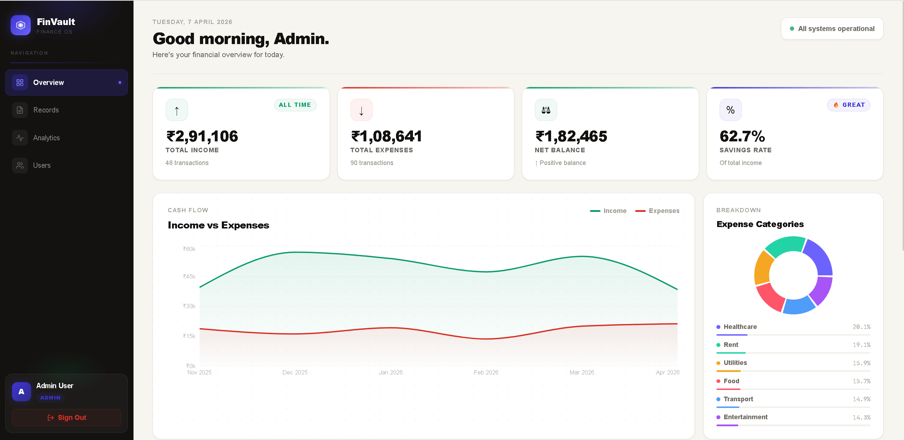
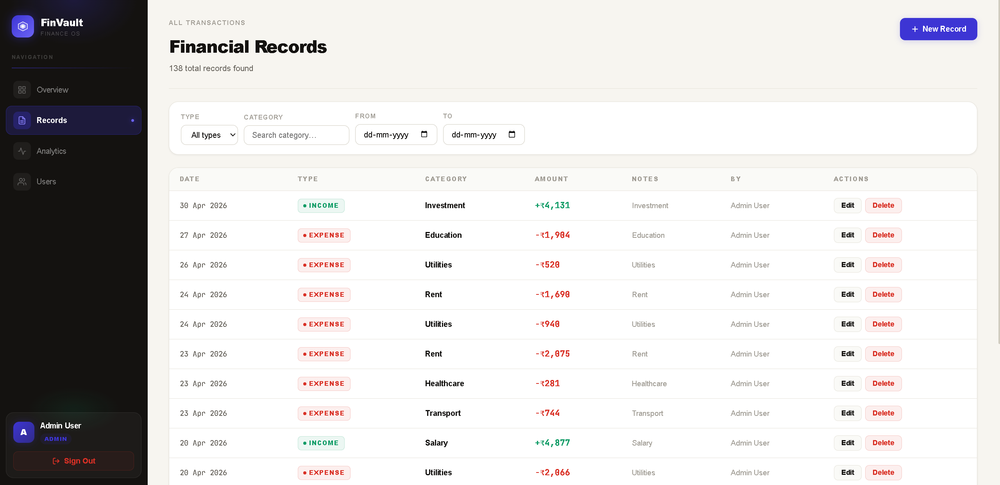
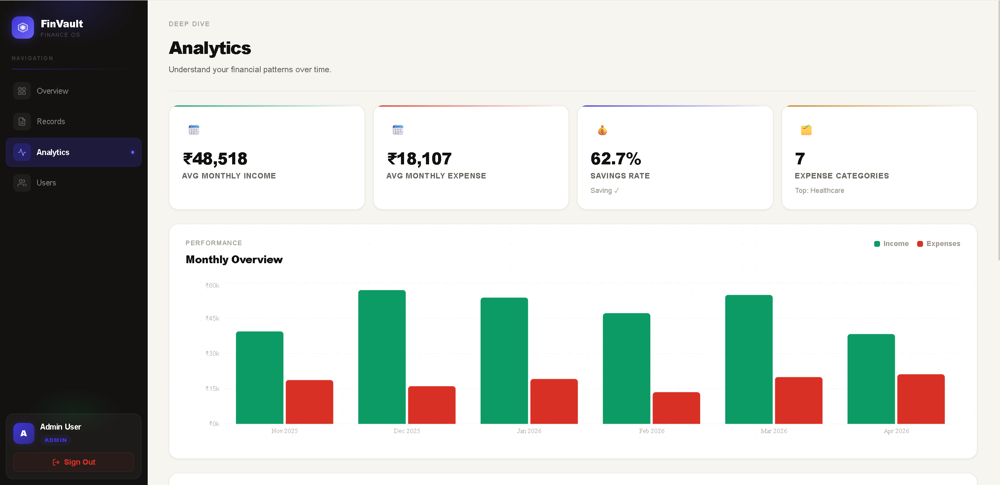
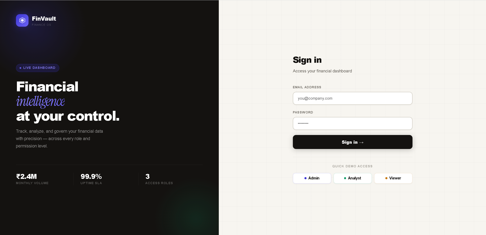

# 💰 FinVault — Finance Intelligence Dashboard

> A full-stack multi-role financial management platform with real-time analytics,
> JWT authentication, and Role-Based Access Control (RBAC).



---

## 🚀 Live Demo

|                | Link                                                   |
| -------------- | ------------------------------------------------------ |
| 🌐 Frontend    | https://finance-dashboard-phi-plum.vercel.app          |
| 🔌 Backend API | https://finance-dashboard-api.onrender.com             |
| 💻 GitHub      | https://github.com/abhijeetgupta1132/finance-dashboard |

---

## 📸 Screenshots

### Dashboard Overview


### Records Management



### Analytics & Insights



### Login Page



---

## ✨ Features

### 🔐 Authentication & Security

- JWT stateless authentication with auto token refresh
- BCrypt password hashing — passwords never stored in plain text
- Role-Based Access Control — Admin, Analyst, Viewer
- Protected frontend routes + backend endpoint guards
- Axios interceptor auto-attaches Bearer token to every request
- Auto logout and redirect on 401 Unauthorized

### 📊 Dashboard (All Roles)

- Total Income, Total Expenses, Net Balance, Record Count cards
- Income vs Expenses area chart — last 6 months
- Expense Breakdown donut chart by category
- Recent Activity feed — latest 10 transactions
- Time-based greeting (Good morning / afternoon / evening)

### 📁 Records (Admin + Analyst)

- Full transaction history with search, filter and sort
- Add, Edit and Delete financial records
- Filter by type (Income / Expense) and by category
- Paginated table view with clean UI

### 📈 Analytics (Admin + Analyst)

- Monthly cash flow trend charts
- Category-wise spending breakdown
- Income vs expense visual comparison

### 👥 Users (Admin Only)

- View all registered users
- Role badges per user

---

## 👥 Demo Credentials

| Role       | Email               | Password   | Access Level                    |
| ---------- | ------------------- | ---------- | ------------------------------- |
| 🔴 Admin   | admin@finance.com   | admin123   | Full access — all pages         |
| 🟡 Analyst | analyst@finance.com | analyst123 | Dashboard + Records + Analytics |
| 🟢 Viewer  | viewer@finance.com  | viewer123  | Dashboard only                  |

---

## 🗂️ Project Structure

```
finance-dashboard/
├── backend/
│   ├── src/
│   │   ├── db.js          # SQLite setup + seed data
│   │   ├── auth.js        # JWT middleware
│   │   └── routes.js      # All REST API endpoints
│   ├── server.js          # Express server entry point
│   └── package.json
│
├── frontend/
│   ├── public/
│   │   └── index.html
│   ├── src/
│   │   ├── components/
│   │   │   ├── Sidebar.jsx    # Navigation + user info + logout
│   │   │   ├── Layout.jsx     # Page wrapper with sidebar
│   │   │   └── UI.jsx         # Reusable UI components
│   │   ├── context/
│   │   │   └── AuthContext.jsx  # Global auth state (login/logout/user)
│   │   ├── pages/
│   │   │   ├── Login.jsx      # Authentication page
│   │   │   ├── Dashboard.jsx  # Overview, stats and charts
│   │   │   ├── Records.jsx    # Transaction management
│   │   │   ├── Analytics.jsx  # Data insights and trends
│   │   │   └── Users.jsx      # User management (Admin only)
│   │   ├── utils/
│   │   │   ├── api.js         # Axios instance + interceptors
│   │   │   └── format.js      # Currency and date formatters
│   │   ├── App.jsx            # Routes, auth guards, role guards
│   │   ├── index.js           # React DOM entry point
│   │   └── index.css          # Global styles and CSS variables
│   └── package.json
│
├── screenshots/               # Project screenshots for README
│   ├── dashboard.png
│   ├── records.png
│   ├── analytics.png
│   └── login.png
│
└── README.md
```

---

## ⚙️ Tech Stack

| Layer              | Technology              |
| ------------------ | ----------------------- |
| Frontend Framework | React 18                |
| Routing            | React Router v6         |
| Charts             | Recharts                |
| HTTP Client        | Axios                   |
| Notifications      | React Hot Toast         |
| Backend            | Node.js + Express.js    |
| Database           | SQLite (better-sqlite3) |
| Authentication     | JWT + BCrypt            |
| Frontend Deploy    | Vercel                  |
| Backend Deploy     | Render                  |

---

## 🔌 REST API Endpoints

| Method | Endpoint           | Access         | Description                  |
| ------ | ------------------ | -------------- | ---------------------------- |
| POST   | `/api/auth/login`  | Public         | Login and receive JWT token  |
| GET    | `/api/auth/me`     | All roles      | Get current logged-in user   |
| GET    | `/api/dashboard`   | All roles      | Summary stats and chart data |
| GET    | `/api/records`     | All roles      | Fetch all transactions       |
| POST   | `/api/records`     | Admin, Analyst | Create new record            |
| PUT    | `/api/records/:id` | Admin, Analyst | Update existing record       |
| DELETE | `/api/records/:id` | Admin only     | Delete a record              |
| GET    | `/api/analytics`   | Admin, Analyst | Trend and breakdown data     |
| GET    | `/api/users`       | Admin only     | All users list               |

---

## 🛠️ Run Locally

### Prerequisites

- Node.js v18+
- npm

### 1. Clone the repo

```bash
git clone https://github.com/abhijeetgupta1132/finance-dashboard.git
cd finance-dashboard
```

### 2. Start Backend

```bash
cd backend
npm install
node server.js
```

Backend runs on: `http://localhost:5000`

### 3. Start Frontend

```bash
cd frontend
npm install
npm start
```

Frontend runs on: `http://localhost:3000`

### 4. Login

Use any demo credential from the table above.

---

## 🔒 Security Architecture

```
Client Request
     │
     ▼
Axios Interceptor (attaches Bearer token)
     │
     ▼
Express Route
     │
     ▼
JWT Middleware (verifies token)
     │
     ▼
Role Guard (checks user.role)
     │
     ▼
Controller → SQLite DB
```

- Tokens verified on every protected request
- Role mismatches return 403 Forbidden
- Expired tokens return 401 and trigger auto-logout

---

## 👨‍💻 Author

**Abhijeet Gupta** — Java Backend + Full Stack Developer

- 📧 abhijeetgupta1132@gmail.com
- 💻 https://github.com/abhijeetgupta1132
- 🔗 https://www.linkedin.com/in/abhijeet-gupta-807876381/
